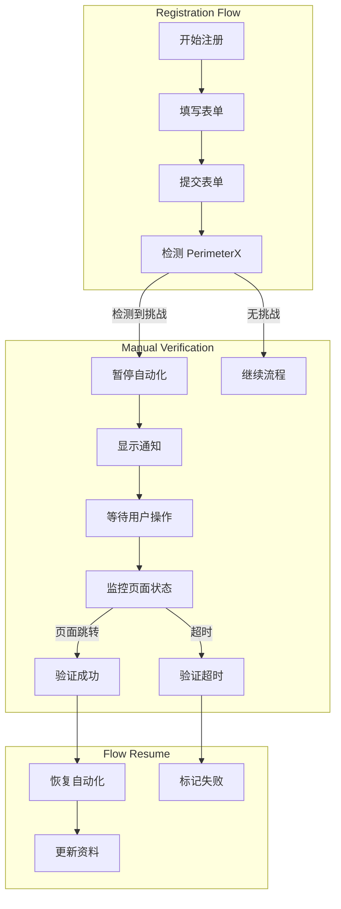

# Design Document

## Overview

本设计文档描述了如何在 Ralph Lauren 自动注册系统中实现人工验证机制。系统将移除所有自动化 PerimeterX 挑战解决代码，改为在检测到验证挑战时暂停自动化流程，等待用户手动完成验证，然后通过监控页面跳转来自动恢复流程。

## Architecture



## Components and Interfaces

### 1. ManualVerificationHandler

新增的人工验证处理器类，负责管理整个人工验证流程。

**职责：**
- 检测 PerimeterX 挑战
- 显示用户通知
- 监控验证完成
- 处理超时

**接口：**

```python
class ManualVerificationHandler:
    def __init__(self, browser: BrowserController, timeout: int = 120):
        """初始化人工验证处理器
        
        Args:
            browser: 浏览器控制器实例
            timeout: 验证超时时间（秒）
        """
        
    def detect_challenge(self) -> Optional[str]:
        """检测 PerimeterX 挑战
        
        Returns:
            挑战类型（如果检测到），否则返回 None
        """
        
    def wait_for_manual_verification(self, expected_url_pattern: str) -> bool:
        """等待用户完成人工验证
        
        Args:
            expected_url_pattern: 验证成功后的预期 URL 模式
            
        Returns:
            True 如果验证成功，False 如果超时
        """
        
    def display_notification(self, challenge_type: str) -> None:
        """显示用户通知
        
        Args:
            challenge_type: 检测到的挑战类型
        """
```

### 2. BrowserController 修改

**移除的方法：**
- `_solve_px_press_hold()` - 删除自动化按住不放解决方案
- `_handle_perimeterx_challenge()` 中的自动解决逻辑

**保留的方法：**
- `navigate()` - 保持页面导航功能
- `wait_for_element()` - 保持元素等待功能
- 挑战检测相关的选择器常量

**新增的方法：**

```python
def wait_for_url_change(self, timeout: int = 120000) -> str:
    """等待 URL 变化
    
    Args:
        timeout: 超时时间（毫秒）
        
    Returns:
        新的 URL
    """
    
def is_challenge_present(self, selectors: List[str]) -> bool:
    """检查挑战元素是否存在
    
    Args:
        selectors: 要检查的选择器列表
        
    Returns:
        True 如果任何挑战元素存在
    """
```

### 3. Registration 修改

**移除的方法：**
- `_handle_px_challenge()` - 删除自动挑战处理
- `_solve_px_press_hold()` - 删除自动解决方案

**修改的方法：**

```python
def submit_and_verify(self, timeout: Optional[int] = None) -> bool:
    """提交注册表单并验证成功
    
    修改后的流程：
    1. 点击提交按钮
    2. 检测 PerimeterX 挑战
    3. 如果检测到挑战，进入人工验证模式
    4. 等待用户完成验证（监控页面跳转）
    5. 验证成功后继续流程
    
    Args:
        timeout: 最大等待时间（毫秒）
        
    Returns:
        True 如果注册成功，False 否则
    """
```

### 4. Config 扩展

在 `Config` 类中添加新的配置项：

```python
@dataclass
class Config:
    # ... 现有配置 ...
    
    # Manual Verification Configuration
    MANUAL_VERIFICATION_TIMEOUT: int = 120  # 秒
    ENABLE_VERIFICATION_NOTIFICATIONS: bool = True
    MAX_VERIFICATION_ATTEMPTS: int = 3
```

## Data Models

### VerificationEvent

新增数据模型，用于记录验证事件：

```python
@dataclass
class VerificationEvent:
    """验证事件记录
    
    Attributes:
        challenge_type: 挑战类型
        start_time: 开始时间
        end_time: 结束时间
        success: 是否成功
        timeout: 是否超时
        duration_seconds: 持续时间（秒）
    """
    challenge_type: str
    start_time: datetime
    end_time: Optional[datetime] = None
    success: bool = False
    timeout: bool = False
    duration_seconds: float = 0.0
    
    def to_dict(self) -> dict:
        """转换为字典格式"""
        return asdict(self)
```

## Correctness Properties

*A property is a characteristic or behavior that should hold true across all valid executions of a system-essentially, a formal statement about what the system should do. Properties serve as the bridge between human-readable specifications and machine-verifiable correctness guarantees.*

### Property 1: 挑战检测完整性
*For any* page state with PerimeterX challenge elements, the detection method SHALL check all configured selectors (captcha containers, modals, iframes) and return the correct challenge type if any selector matches.
**Validates: Requirements 1.1, 1.2, 1.3**

### Property 2: 自动化暂停保证
*For any* detected PerimeterX challenge, the system SHALL immediately enter manual verification mode without attempting any automatic solving methods, and all automated interactions SHALL be paused.
**Validates: Requirements 2.1, 9.1, 9.6**

### Property 3: 验证完成检测
*For any* manual verification wait period, if the current URL matches the expected success pattern OR all PerimeterX challenge elements disappear from the page, then the verification SHALL be marked as complete.
**Validates: Requirements 3.2, 3.3, 3.4, 3.5**

### Property 4: 验证超时边界
*For any* manual verification wait period, if the elapsed time exceeds the configured timeout, then the wait method SHALL return False, log a timeout event, and mark the verification as timed out.
**Validates: Requirements 4.1, 4.2, 4.4**

### Property 5: 验证事件日志完整性
*For any* verification event (detection, entry, completion, timeout, or failure), the logged data SHALL include all required fields: challenge type, timestamp, duration, and status-specific information (success/timeout/failure reason).
**Validates: Requirements 7.1, 7.2, 7.3, 7.4, 7.5, 2.5**

### Property 6: 多次验证处理一致性
*For any* sequence of verification challenges within a single iteration, each challenge SHALL be handled independently using the same verification logic, and if more than 3 challenges occur, the iteration SHALL be marked as failed.
**Validates: Requirements 8.1, 8.2, 8.3, 8.4**

### Property 7: 流程恢复状态一致性
*For any* successful verification, the system SHALL log a success event, verify the current page state matches the expected state, and resume automated flow from the correct next step.
**Validates: Requirements 5.1, 5.2, 5.3, 5.5**

## Error Handling

### 挑战检测错误
- **元素查找失败**：记录警告日志，假设无挑战继续流程
- **多个挑战类型同时出现**：选择第一个检测到的类型
- **检测超时**：3秒内未完成检测视为无挑战

### 人工验证错误
- **超时**：记录超时事件，标记迭代失败，清理资源
- **浏览器崩溃**：捕获异常，记录错误，标记迭代失败
- **用户关闭浏览器**：检测到浏览器关闭，标记迭代失败

### 流程恢复错误
- **页面状态不匹配**：记录错误，尝试刷新页面重新检查
- **后续步骤失败**：正常错误处理流程，不影响验证成功记录

### 日志错误
- **日志写入失败**：打印到控制台作为备份
- **日志文件权限问题**：尝试使用临时目录

## Testing Strategy

### 单元测试

使用 pytest 进行单元测试：

1. **挑战检测测试**
   - 测试各种 PerimeterX 选择器的检测
   - 测试无挑战情况
   - 测试多个挑战元素同时存在

2. **超时机制测试**
   - 测试超时计时器准确性
   - 测试超时后的状态
   - 测试提前完成的情况

3. **URL 监控测试**
   - 测试 URL 变化检测
   - 测试 URL 模式匹配
   - 测试无变化情况

4. **配置加载测试**
   - 测试默认配置值
   - 测试自定义配置
   - 测试配置验证

### 属性测试

使用 hypothesis 库进行属性测试：

1. **Property 1: 挑战检测准确性**
   ```python
   @given(page_html=html_with_challenge_elements())
   def test_challenge_detection_accuracy(page_html):
       """测试挑战检测的准确性"""
       # Feature: manual-verification, Property 1
   ```

2. **Property 2: 验证超时边界**
   ```python
   @given(timeout=st.integers(min_value=1, max_value=300))
   def test_verification_timeout_boundary(timeout):
       """测试验证超时边界"""
       # Feature: manual-verification, Property 2
   ```

3. **Property 6: 验证事件日志完整性**
   ```python
   @given(event=verification_events())
   def test_verification_event_logging(event):
       """测试验证事件日志完整性"""
       # Feature: manual-verification, Property 6
   ```

### 集成测试

1. **完整流程测试**
   - 模拟注册流程中出现挑战
   - 手动完成验证
   - 验证流程自动恢复

2. **多次挑战测试**
   - 模拟一个流程中多次出现挑战
   - 验证每次都能正确处理

3. **超时场景测试**
   - 模拟用户未在时间内完成验证
   - 验证系统正确处理超时

### 手动测试

由于涉及人工交互，需要进行手动测试：

1. **真实环境测试**
   - 在真实 Ralph Lauren 网站测试
   - 验证通知显示正确
   - 验证手动完成后流程恢复

2. **用户体验测试**
   - 验证通知信息清晰
   - 验证等待时间合理
   - 验证错误提示友好

## Implementation Notes

### 代码移除清单

需要从以下文件中移除自动化验证代码：

1. **src/registration.py**
   - 移除 `_handle_px_challenge()` 方法
   - 移除 `_solve_px_press_hold()` 方法
   - 修改 `submit_and_verify()` 方法

2. **src/browser_controller.py**
   - 移除 `_handle_perimeterx_challenge()` 方法
   - 移除 `_solve_px_press_hold()` 方法
   - 保留挑战选择器常量供检测使用

### 新增文件

1. **src/manual_verification.py**
   - 实现 `ManualVerificationHandler` 类
   - 实现 `VerificationEvent` 数据模型
   - 实现通知显示逻辑

### 配置更新

在 `src/config.py` 中添加：
```python
# Manual Verification Configuration
MANUAL_VERIFICATION_TIMEOUT: int = 120  # seconds
ENABLE_VERIFICATION_NOTIFICATIONS: bool = True
MAX_VERIFICATION_ATTEMPTS: int = 3
```

### 日志格式

验证事件日志格式：
```
[MANUAL_VERIFICATION] Challenge detected: {challenge_type} at {timestamp}
[MANUAL_VERIFICATION] Waiting for user to complete verification (timeout: {timeout}s)
[MANUAL_VERIFICATION] Verification completed successfully in {duration}s
[MANUAL_VERIFICATION] Verification timed out after {duration}s
```

### 通知显示

控制台通知格式：
```
╔════════════════════════════════════════════════════════════╗
║  PerimeterX 验证挑战检测                                    ║
║                                                            ║
║  请在浏览器中手动完成验证                                    ║
║  验证成功后页面将自动跳转                                    ║
║                                                            ║
║  超时时间: 120 秒                                           ║
║  剩余时间: 115 秒                                           ║
╚════════════════════════════════════════════════════════════╝
```

## Performance Considerations

### 检测性能
- 挑战检测应在 3 秒内完成
- 使用缓存的选择器列表避免重复查询
- 并行检查多个选择器

### 监控性能
- URL 变化监控使用事件监听而非轮询
- 元素存在检查间隔 1 秒
- 避免频繁的 DOM 查询

### 资源管理
- 验证超时后立即释放浏览器资源
- 清理事件监听器避免内存泄漏
- 限制日志文件大小

## Security Considerations

### 日志安全
- 不在日志中记录敏感信息（密码、邮箱完整内容）
- 使用脱敏处理显示部分信息

### 浏览器安全
- 保持浏览器窗口可见以便用户操作
- 不允许在验证期间执行其他自动化操作
- 验证超时后确保清理所有会话

## Migration Strategy

### 向后兼容
- 保留原有的配置项
- 新增配置项使用默认值
- 不影响其他模块的功能

### 渐进式迁移
1. 第一阶段：添加人工验证功能，保留自动化作为备选
2. 第二阶段：默认使用人工验证，自动化可配置关闭
3. 第三阶段：完全移除自动化验证代码

### 回滚计划
- 保留旧版本代码的 Git 分支
- 提供配置开关快速切换
- 准备详细的回滚文档
