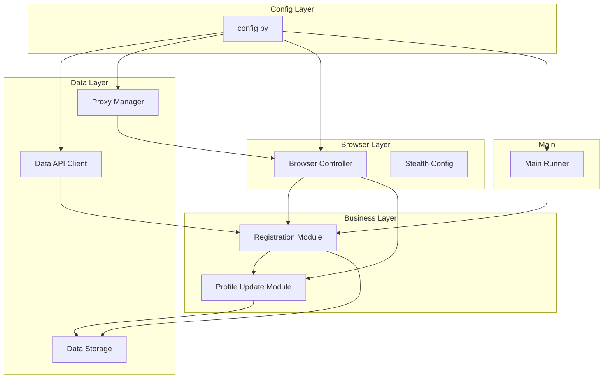

# Design Document

## Overview

Ralph Lauren 自动注册系统是一个基于 Python 的自动化工具，使用 Playwright 进行浏览器自动化，通过代理IP池从API获取用户数据完成批量账户注册。系统采用模块化设计，包含配置管理、代理验证、数据获取、浏览器控制和注册流程等核心组件。

## Architecture

## Components and Interfaces

### 1. Config Module (config.py)

配置类，存储所有系统参数。

### 2. Proxy Manager (proxy_manager.py)

代理管理器，负责生成、验证和筛选US代理。

### 3. Data API Client (api_client.py)

API客户端，从数据接口获取用户信息。

### 4. Browser Controller (browser_controller.py)

浏览器控制器，封装Playwright操作和反检测配置。

### 5. Registration Module (registration.py)

注册模块，执行完整的注册表单填写和提交流程。

### 6. Profile Update Module (profile_update.py)

资料更新模块，更新生日和电话信息。

### 7. Data Storage (storage.py)

数据存储模块，保存成功注册的账户信息。

### 8. Main Runner (main.py)

主运行器，协调各模块执行批量注册。

## Data Models

### UserData
- email: str - 用户邮箱
- first_name: str - 名
- last_name: str - 姓
- password: str - 密码
- phone_number: str - 电话号码

### ProxyValidationResult
- is_valid: bool - 代理是否有效
- latency_ms: float - 延迟毫秒数
- country: str - 国家代码
- region: str - 地区名称

### AccountRecord
- email: str - 邮箱
- password: str - 密码
- birthday: str - 生日
- created_at: datetime - 创建时间

## Correctness Properties

*A property is a characteristic or behavior that should hold true across all valid executions of a system-essentially, a formal statement about what the system should do. Properties serve as the bridge between human-readable specifications and machine-verifiable correctness guarantees.*

### Property 1: API数据解析往返一致性
*For any* valid UserData object, serializing to JSON then parsing back SHALL produce an equivalent UserData object with identical field values.
**Validates: Requirements 1.2**

### Property 2: 随机日期范围有效性
*For any* generated random day, the value SHALL be within the range 1 to 28 inclusive.
**Validates: Requirements 1.3**

### Property 3: 代理URL格式正确性
*For any* generated proxy URL, it SHALL contain the configured IP address and a port number within the range 50000 to 50020.
**Validates: Requirements 2.1**

### Property 4: US代理筛选正确性
*For any* proxy validation result, if the country code is "US" then is_valid SHALL be true, otherwise is_valid SHALL be false.
**Validates: Requirements 2.4**

### Property 5: 动态ID选择器匹配
*For any* 12-character alphanumeric suffix, the password field selector SHALL correctly match elements with id pattern "dwfrm_profile_login_password_{suffix}".
**Validates: Requirements 4.3, 4.4**

### Property 6: 月份名称有效性
*For any* month value from the valid set of English month names, the profile update module SHALL accept it as valid input.
**Validates: Requirements 5.1**

### Property 7: 数据存储往返一致性
*For any* AccountRecord, saving to storage then loading back SHALL produce an equivalent record with identical email, password, and birthday values.
**Validates: Requirements 6.1**

### Property 8: 数据追加保持完整性
*For any* sequence of save operations, loading all records SHALL return all previously saved records in order without data loss.
**Validates: Requirements 6.2**

## Error Handling

### API错误处理
- 网络超时：重试3次，每次间隔5秒
- JSON解析失败：记录错误日志，跳过当前迭代
- 字段缺失：验证必填字段，缺失时抛出异常

### 代理错误处理
- 代理连接失败：尝试下一个随机端口
- 代理验证超时：设置10秒超时，超时视为失败
- 非US代理：自动重试获取新代理，最多尝试10次

### 浏览器错误处理
- 页面加载超时：设置30秒超时，超时后刷新重试
- 元素未找到：等待最多10秒，使用模糊匹配选择器
- PerimeterX拦截：记录日志，更换代理重试

### 注册错误处理
- 表单提交失败：检查错误消息，记录日志
- 注册成功监控超时：30秒内未检测到成功URL视为失败
- 资料更新失败：记录日志，但不影响注册成功状态

## Testing Strategy

### 单元测试
使用 pytest 进行单元测试：
- 测试配置加载
- 测试代理URL生成
- 测试数据解析
- 测试存储读写

### 属性测试
使用 hypothesis 库进行属性测试：
- 每个属性测试运行最少100次迭代
- 测试标注格式：**Feature: ralph-lauren-auto-register, Property {number}: {property_text}**

### 集成测试
- 使用mock服务器测试API客户端
- 使用Playwright测试模式验证浏览器自动化流程

